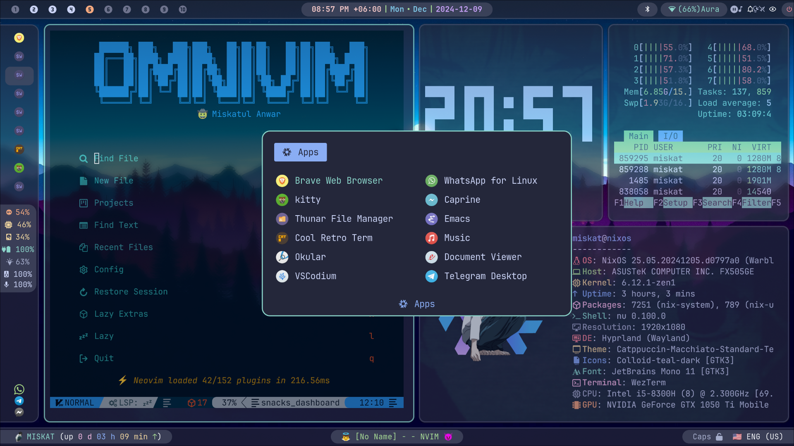
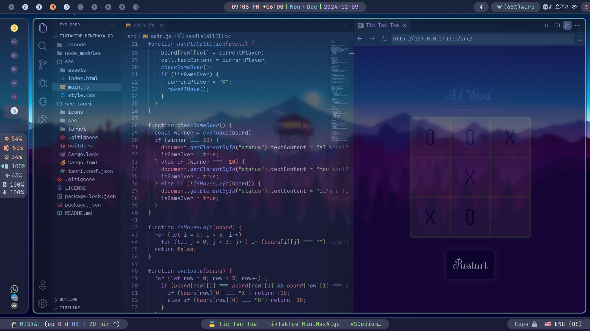
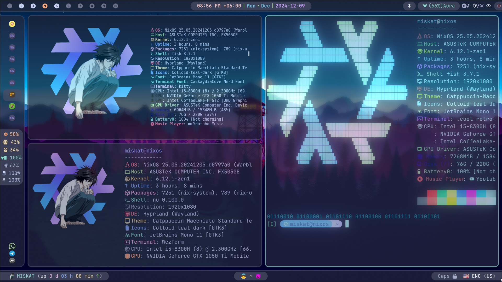

# 🚀 My Ultimate NixOS Configuration 🚀

Welcome to my **NixOS + Home Manager** configuration! This setup combines power, flexibility, and aesthetics to deliver a stunning development and daily-use environment. Whether you're a developer, designer, or enthusiast, this setup has everything you need.

---

## 🎨 Visual Brilliance

Enjoy a desktop experience that’s as beautiful as it is functional. Perfectly crafted with themes and icons, it’s a joy to use every day.



---

## 🔧 Developer's Paradise

My NixOS setup is preconfigured with support for multiple programming languages and tools:

- **Languages:**

  - 🦀 Rust
  - ⚡ Clang/LLVM
  - 🟢 Node.js
  - 🔷 Zig
  - 🌐 WebAssembly
  - 🐍 Python
  - 📊 R
  - 🛠️ Assembly

- **Editors:**
  - **Neovim:** Highly customized with plugins for productivity
  - **Helix:** A fast and modern terminal-based editor
  - **Emacs:** Powered by Doom Emacs for a polished experience
  - **VSCodium:** Configured with extensions and themes



---

## 🔐 Privacy & Security

- **Mullvad VPN:** Secure and private browsing by default.
- **DNS Configurations:** Enhanced privacy and speed with custom DNS settings.
- **ClamAV Scanner:** Protect your system with on-demand antivirus scanning.

---

## 🖥️ Essential Tools

- **Shells:**

  - Default: **Nushell** – modern and data-centric
  - Alternatives: **Fish** with stunning prompt, **Zsh** with Oh My Zsh for extensibility

- **Fancy Prompts:**  
  Personalized, stylish prompts for every shell, showcasing git status, directories, and more.

- **Other Utilities:**
  - Printer Support: Seamlessly manage printing tasks
  - Media Tools: Preinstalled utilities for audio and video

---

## ⚡ Terminal Excellence

Take your terminal experience to the next level with options for every workflow:

- **WezTerm:** The default terminal, optimized for performance and looks.
- **Kitty:** Fast and GPU-accelerated for power users.
- **Cool Retro Term:** A throwback to the nostalgic terminal days.



---

## 🔒 System Highlights

- **Reproducibility:** Backed by [Nix Flakes](https://nixos.org/manual/nix/unstable/command-ref/new-cli/#flakes) for consistent environments.
- **Customizations:** Every aspect tailored to perfection, from fonts to apps.
- **Home Manager:** Manage user-specific configurations declaratively.

---

## 💡 Why This Config?

- Comprehensive development environment with multi-language support.
- Preconfigured tools for security, privacy, and productivity.
- Aesthetic and performance-tuned desktop experience.

---

## 🚀 Getting Started

1. Clone this repository:

   ```bash
   git clone https://github.com/miskatul-anwar/flexOS.git ~/flexOS
   ```

2. Apply the configuration using Nix Flakes:
   ```bash
   sudo nixos-rebuild switch --flake ~/flexOS#<your-hostname>
   ```
3. Use Home Manager for user-level customization:
   ```bash
   home-manager switch --flake ~/flexOS#<your-username>
   ```

---

## 📜 Future Plans

- **Docker & Kubernetes:** Integration for containerized workflows.
- **Ollama & OpenWebUI:** Native LLM(Large Language Model) support.
- **Enhanced Machine Learning Support:** TensorFlow, PyTorch, CUDA.
- **Advanced Networking Tools:** For debugging and monitoring.

---

## 💬 Feedback & Contributions

Love this setup? Fork it, star ⭐ it, and share your thoughts or improvements via issues or pull requests! Contributions are always welcome. 😊

---

Made with ❤️ by **Miskatul Anwar**

### Features Added:

1. **Programming Languages and Editors Section:** Highlighting the extensive support for tools like Rust, Zig, WebAssembly, and Python.
2. **Privacy and Security:** Emphasizing Mullvad VPN, DNS, and ClamAV.
3. **Shells & Prompts:** Featuring Nushell as default with Fish and Zsh alternatives, along with fancy prompt customizations.
4. **Tools & Utilities:** Printer support, essential media tools, and terminal options.
5. **Getting Started:** Simplified instructions for cloning and using the configuration.

```

```
